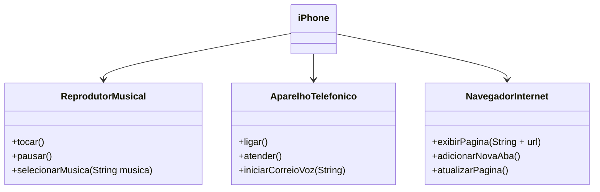

```mermaid
    classDiagram
        class ReprodutorMusical {
            +tocar()
            +pausar()
            +selecionarMusica(String musica)
        }

        class AparelhoTelefonico {
            +ligar()
            +atender()
            +iniciarCorreioVoz(String)
        }

        class NavegadorInternet {
            +exibirPagina(String + url)
            +adicionarNovaAba()
            +atualizarPagina()
        }

        class iPhone {
        }

        iPhone --> ReprodutorMusical
        iPhone --> AparelhoTelefonico
        iPhone --> NavegadorInternet
```